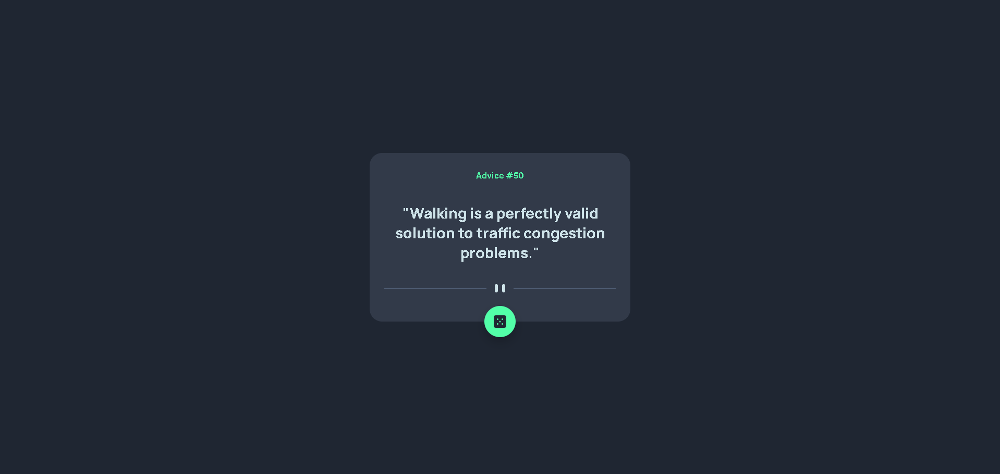

# Frontend Mentor - Advice Generator App Solution

This is my solution to the [Advice generator app challenge on Frontend Mentor](https://www.frontendmentor.io/challenges/advice-generator-app-QdUG-13db). The goal was to build an app that fetches and displays random advice, with a responsive layout and interactive elements.

## Table of Contents

- [Overview](#overview)
- [Features](#features)
- [Demo](#demo)
- [Built With](#built-with)
- [What I Learned](#what-i-learned)
- [Useful Resources](#useful-resources)
- [Author](#author)

## Overview

The Advice Generator App allows users to generate random advice by clicking a button. The app is fully responsive and includes smooth hover effects for interactive elements.

## Features

- Responsive design for mobile and desktop
- Fetches random advice from an API
- Interactive dice button with hover effect

## Demo



- [Live Site](https://legendary-blini-9f69c7.netlify.app)

## Built With

- HTML5
- CSS3 (Flexbox, Grid, custom properties)
- JavaScript (ES6+)

## What I Learned

- How to fetch data from a public API and handle asynchronous operations in Javascript
- Improved skills in responsive design using CSS Grid and Flexbox

```js
// Example: Fetching advice from the API
const getAdvice = async () => {
  try {
    const res = await fetch("https://api.adviceslip.com/advice");
    const data = await res.json();
    return data.slip;
  } catch (error) {
    return { id: "Error", advice: "Could not fetch advice" };
  }
};
```

## Useful Resources

- [Advice Slip JSON API](https://api.adviceslip.com/) - Used for fetching random advice.
- [MDN Web Docs - Fetch API](https://developer.mozilla.org/en-US/docs/Web/API/Fetch_API) - Reference for making HTTP requests.

## Author

- [Frontend Mentor](https://www.frontendmentor.io/profile/ffozdemir)
- [GitHub](https://www.github.com/ffozdemir)
